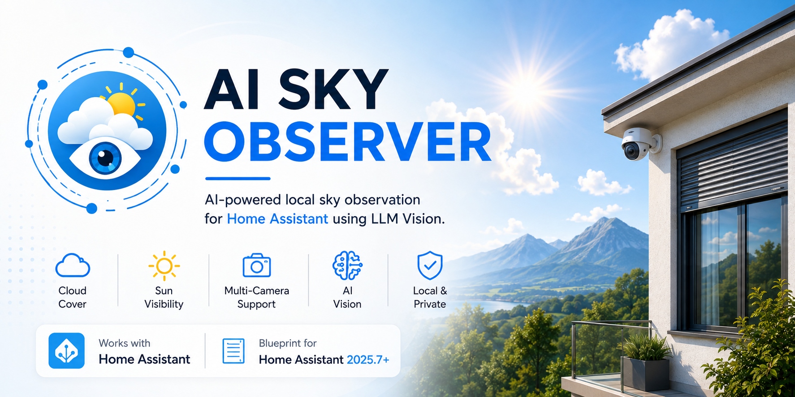

<p align="center">
  
</p>

# AI Sky Observer

> AI-powered local sky observation for Home Assistant using LLM Vision.

AI Sky Observer transforms one or more outdoor cameras into intelligent local sky sensors, allowing Home Assistant to make decisions based on what is happening **above your home right now**, not just what a weather service predicts for your area.

---

# Why AI Sky Observer Exists

AI Sky Observer was born while developing **Adaptive Cover Controller**.

One of the biggest challenges with automating blinds, curtains and shutters is determining whether the sun is actually shining on your home.

Most Home Assistant automations rely on cloud cover values from online weather services. While these services are excellent for forecasting regional weather, they estimate conditions across a large geographic area—not the sky directly above your property.

For automations that depend on direct sunlight, that distinction matters.

A weather service may report **20% cloud cover** while a cloud temporarily blocks the sun over your house. Equally, it may report **80% cloud cover** while your home enjoys uninterrupted sunshine through a gap in the clouds.

AI Sky Observer was created to bridge that gap.

---

# Forecast vs Observation

Weather services answer one question:

> **"What is the weather like in my area?"**

AI Sky Observer answers another:

> **"What is happening above my home right now?"**

Using one or more outdoor cameras together with LLM Vision, AI Sky Observer continuously observes the visible sky and converts those observations into Home Assistant sensor entities.

Instead of forecasting the weather, it observes it.

---

# Features

- ☁️ AI Cloud Cover Estimation
- ☀️ Direct Sun Visibility Detection
- 🎯 AI Confidence Scoring
- 📷 Multi-camera Support
- 🌞 Daylight-aware Analysis
- 🏡 Native Home Assistant Sensor Entities
- 🤖 Compatible with any LLM Vision provider
- 📊 Optional Home Assistant dashboard

---

# Dashboard

<p align="center">
  
</p>

An optional dashboard is included with the project, providing an overview of the current AI observations.

It displays:

- Sky Condition
- Average Cloud Cover
- Camera 1 Cloud Cover
- Camera 2 Cloud Cover
- Camera 1 Sun Visibility
- Camera 2 Sun Visibility
- Camera 1 Confidence
- Camera 2 Confidence
- Last Analysis Time
- Observer Status

Dashboard YAML:

```text
dashboard/ai_sky_observer_dashboard.yaml
```

---

# What AI Sky Observer Creates

The package creates the following Home Assistant entities.

| Entity | Description |
|---------|-------------|
| AI Sky Observer Cloud Cover | Average cloud cover across all configured cameras |
| AI Sky Observer Condition | Overall AI-derived sky condition |
| Camera 1 Cloud Cover | Cloud cover estimated from Camera 1 |
| Camera 2 Cloud Cover | Cloud cover estimated from Camera 2 |
| Camera 1 Confidence | AI confidence score for Camera 1 |
| Camera 2 Confidence | AI confidence score for Camera 2 |
| Camera 1 Sun Visible | Direct sun detected by Camera 1 |
| Camera 2 Sun Visible | Direct sun detected by Camera 2 |

---

# Works Perfectly With Adaptive Cover Controller

AI Sky Observer was originally developed to complement **Adaptive Cover Controller**.

Instead of relying solely on forecast data, Adaptive Cover Controller can use real-time AI observations from your own cameras to determine whether direct sunlight is actually reaching your home.

Together they create automations that respond to **local conditions**, rather than regional weather forecasts.

**Adaptive Cover Controller**

https://github.com/wgumaa/Adaptive-Cover-Controller

---

# Requirements

Before installing AI Sky Observer you will need:

- Home Assistant
- LLM Vision
- One or more outdoor cameras
- Any supported LLM Vision provider

Supported providers include:

- Google Gemini
- OpenAI
- Anthropic
- Ollama
- LocalAI
- ...and many more

---

# Installation

Installation instructions are available in:

```text
docs/installation.md
```

---

# Repository Structure

```text
AI-Sky-Observer/
├── dashboard/
│   └── ai_sky_observer_dashboard.yaml
├── docs/
│   ├── installation.md
│   ├── dashboard.md
│   ├── faq.md
│   └── roadmap.md
├── images/
│   ├── banner.png
│   └── dashboard.png
├── package/
│   └── ai_sky_observer.yaml
├── CHANGELOG.md
├── LICENSE
└── README.md
```

---

# Design Philosophy

AI Sky Observer follows one simple principle:

> **AI observes. Home Assistant decides.**

The AI never controls devices directly.

Instead, it creates reliable Home Assistant sensor entities that can be used throughout Home Assistant in automations, scripts, dashboards and blueprints.

---

# Documentation

Additional documentation is available in the **docs** folder.

- 📖 Installation Guide
- 🖥 Dashboard Guide
- ❓ Frequently Asked Questions
- 🛣 Project Roadmap

---

# Project Status

🚧 **Active Development**

Current release:

**v0.1.0**

Suggestions, bug reports and feature requests are always welcome.

---

# Roadmap

Future development includes:

### ☀️ Sky Observation

- Improved Sky Classification
- Sky Brightness Estimation
- Rain Detection
- Snow Detection
- Fog Detection
- Smoke Detection

### 📷 Camera Health

- Spider Web Detection
- Dirty Lens Detection
- Camera Health Monitoring

### 🚀 Future Enhancements

- Support for additional cameras
- Historical sky statistics
- Observation trends
- Additional AI environmental sensors

See **docs/roadmap.md** for the complete roadmap.

---

# Contributing

Contributions, suggestions and feedback are always welcome.

If you discover a bug, have an idea for a new feature or would like to contribute, feel free to open an Issue or submit a Pull Request.

---

# License

Released under the MIT License.